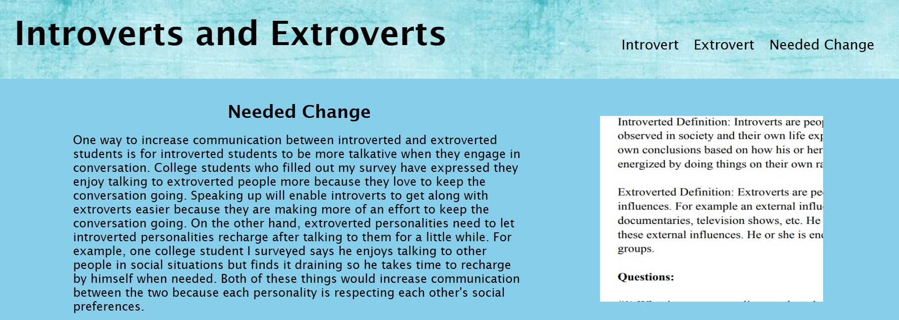

# Title
Introvert Webpage

# Description
This is the website I created for my Capstone Project during Fall Semester 2022 at Utah Valley University. The topic I chose for my 
capstone project was centered on children being socially isolated at school because they are labled as strange or wierd by their 
classmates. There are a lot of factors that cause this to occur but, I chose to focus on introverted and extroverted personalities
because I am introverted myself. The focus of this website is to increase understanding between both personality types so that 
social isolation happens less at school. 

# Website Organization
I split my website up into three different sections based on the information I was able to gather from the research I conducted.
Two of the sections focuses on each personality type and explains why each personality type behaves the way they do when it 
comes to social interaction. The last page talks about changes that need to occur in order to increase understanding between
introverted/extroverted personalities and decrease social isolation overall. Each page has an interactive feature that allows pepole
to learn more about each personality type, explain how they feel being an introvert or an extrovert and leave feedback for me
as the developer of the website. 

# Website Link: 
<a href="https://joker282855.github.io/introvert-webpage/">Website Link</a> 

# Screenshot of Website

# Contributors
Josh Jackson